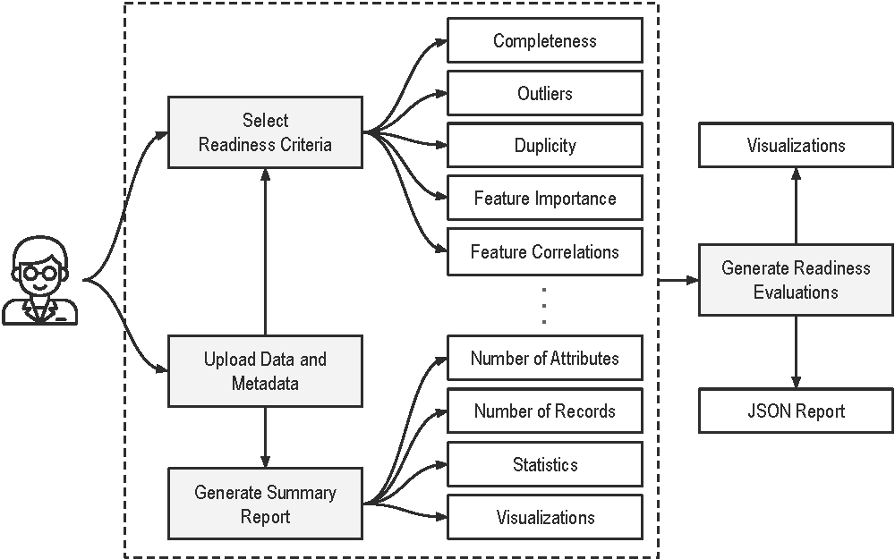

AIDRIn (AI Data Readiness Inspector)
===================================

AIDRIn is a framework that covers a broad range of readiness dimensions available in the literature that aids in quantitatively and qualitatively evaluating the readiness of data. AIDRIn uses metrics in traditional data quality assessment such as completeness, outliers, and duplicity for data evaluation. Furthermore, AIDRIn uses metrics specific to assess data for AI, such as feature importance, feature correlations, class imbalance, fairness, privacy, and FAIR (Findability, Accessibility, Interoperability, and Reusability) principle compliance.  AIDRIn provides visualizations and reports to assist data scientists in further investigating the readiness of data. The AIDRIn framework enhances the efficiency of the machine learning pipeline to make informed decisions on data readiness for AI applications. AIDRIn offers multiple ways for users to analyze data. The web interface or the `UI version <https://github.com/idtlab>`_ is developed using HTML and JavaScript, which allows the users to upload datasets and to start the analysis process. Web requests from the user will then launch the Flask server and generate the analysis results and visualizations. Additionally, AIDRIn offers a `PyPI (Python Package Index) package <https://test.pypi.org/project/aidrin/#history>`_ to users who are proficient in Python and comfortable in using environments like Jupyter Notebooks. Users can install AIDRIn PyPI package via command-line and use it for data readiness assessment. This package can also be used to improve the modularity of AIDRIn by allowing contributors to expand the accessibility of AIDRIn to different domains.

.. note::

   This project is under active development.

Contents
--------

.. toctree::

   installation
   usage
